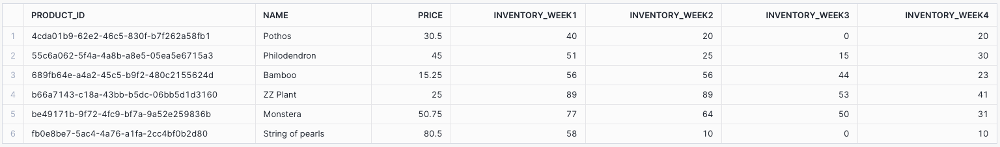

# Week 4
## Part 1:  dbt Snapshots

### Which products had their inventory change from week 3 to week 4?

```sql
select *
from dev_db.dbt_valgerdursidekickhealthcom.product_inventory_snapshot
where date(dbt_updated_at) = '2024-10-29' or date(dbt_valid_to) = '2024-10-29'

```

**Answer:**  
These products had their inventory changed from week 3 to 4:
- product_id = b66a7143-c18a-43bb-b5dc-06bb5d1d3160
- product_id = 689fb64e-a4a2-45c5-b9f2-480c2155624d
- product_id = 55c6a062-5f4a-4a8b-a8e5-05ea5e6715a3
- product_id = be49171b-9f72-4fc9-bf7a-9a52e259836b
- product_id = 4cda01b9-62e2-46c5-830f-b7f262a58fb1
- product_id = fb0e8be7-5ac4-4a76-a1fa-2cc4bf0b2d80


### Which products had the most fluctations in inventory?

```sql

-- Find all products that have an inventory change at some point during the past weeks
-- Inventory that is not valid anymore
with inventory_not_valid as (
    select product_id
            , name
            , price  
            , inventory
            , dbt_updated_at
            , dbt_valid_from
            , dbt_valid_to
    from dev_db.dbt_valgerdursidekickhealthcom.product_inventory_snapshot
    where dbt_valid_to is not null 
    order by product_id 
),
-- Current inventory
current_inventory as (
    select ic.product_id
            , s.name
            , s.price
            , s.inventory
            , s.dbt_updated_at
            , s.dbt_valid_from
            , s.dbt_valid_to
    from inventory_not_valid as ic 
    inner join dev_db.dbt_valgerdursidekickhealthcom.product_inventory_snapshot s on s.product_id = ic.product_id
    where s.dbt_valid_to is null 
), 
-- All inventory changes
all_inventory_changes as (
    select *
    from inventory_not_valid
    
    union distinct 
    
    select *
    from current_inventory
    order by product_id, dbt_valid_from desc
),
-- Create colimn for each week's inventoru
inventory_changes_per_week as (
    select product_id
            , name
            , price
            , case 
                when date(dbt_valid_from) = '2024-10-10' and (date(dbt_valid_to) <= '2024-10-29' or date(dbt_valid_to) is null) then inventory 
              end as inventory_week1
            , case 
                -- change from week 1 to 2
                when date(dbt_valid_from) = '2024-10-16' and (date(dbt_valid_to) <= '2024-10-29' or date(dbt_valid_to)is null) then inventory 
                -- no change from week 1 to 2
                when date(dbt_valid_from) = '2024-10-10' and (date(dbt_valid_to) > '2024-10-16' and date(dbt_valid_to) <= '2024-10-29' or date(dbt_valid_to) is null) then inventory
              end as inventory_week2
            , case 
                -- change from week 2 to 3
                when date(dbt_valid_from) = '2024-10-22' and (date(dbt_valid_to) <= '2024-10-29' or date(dbt_valid_to) is null) then inventory 
                -- no change from week 1 to 3
                when date(dbt_valid_from) = '2024-10-10' and (date(dbt_valid_to) > '2024-10-22' and date(dbt_valid_to) <= '2024-10-29' or date(dbt_valid_to) is null) then inventory
                -- no change from week 2 to 3
                when date(dbt_valid_from) = '2024-10-16' and (date(dbt_valid_to) > '2024-10-22' and date(dbt_valid_to) <= '2024-10-29' or date(dbt_valid_to) is null) then inventory
              end as inventory_week3
            , case 
                -- change from week 3 to 4
                when date(dbt_valid_from) = '2024-10-29' and date(dbt_valid_to) is null then inventory 
                -- no change from week 1 to 4
                when date(dbt_valid_from) = '2024-10-10' and (date(dbt_valid_to) > '2024-10-29' or date(dbt_valid_to) is null) then inventory           
                -- no change from week 2 to 4
                when date(dbt_valid_from) = '2024-10-16' and (date(dbt_valid_to) > '2024-10-29' or date(dbt_valid_to) is null) then inventory 
                -- no change from week 3 to 4
                when date(dbt_valid_from) = '2024-10-22' and (date(dbt_valid_to) > '2024-10-29' or date(dbt_valid_to) is null) then inventory
              end as inventory_week4
    from all_inventory_changes
)
select product_id
        , name
        , price
        , sum(inventory_week1) as inventory_week1
        , sum(inventory_week2) as inventory_week2
        , sum(inventory_week3) as inventory_week3
        , sum(inventory_week4) as inventory_week4
from inventory_changes_per_week
group by product_id
        , name
        , price
 order by product_id

```



**Answer:**
The products in the table above had the most inventory fluctations.


### Did we have any item go out of stock in the last 3 weeks?

**Answer:**
Yes, in week 3 two products were out of stock:  
- Pothos (product_id = 4cda01b9-62e2-46c5-830f-b7f262a58fb1)
- String of pearls (product_id = fb0e8be7-5ac4-4a76-a1fa-2cc4bf0b2d80)


## Part 2:  Modeling challenge

I added the model fact_product_funnel.sql under model/marts/product.  This table is an aggregated version of fact_page_views where we count number of unique sessions for each event_type.

The table fact_product_funnel was then used in the sigma dashboard created where the product funnel was visualized.

### How are our users moving through the product funnel?

**Answer:**
578 sessions had a page view event, then 467 sessions (80%) also had an add to cart event and then 361 sessions (62%) had a checkout event.  This means that 42% of all sessions do not lead to a purchase.

I created a Product Funnel dashboard for the Product and Engineering teams to be able to monitor the product funnel and purchases made.  This is a link to the dashboard: 
 https://app.sigmacomputing.com/corise-dbt/workbook/workbook-4qBWAMm7fn2f4PhMTHBxT5?:link_source=share 

 In the dashboard you can see hte product funnel as well as the conversion rates per product.

 Things that would be interesting to investigate further:
 - It would be interesting to know why products are added to cart and then not purchased, is it because they go out of stock or is it because of a different reason.
 - In the dashboard we can see that the most popular product is String of pearls which went out of stock in week 3.  It is likely we had gotten more purchases for String of pearls if it had not been out of stock.
 - In the dashboard we can also see that the revenue between states differ.  It would be interesting to understand why we have more purchases in certain states.


### Which steps in the funnel have the largest drop off points?

**Answer:**  
The largest drop off is between page views and add to cart, it is 20%.


### Create an exposure

An exposure for the Product Funnel dashboard was created and it can be seen in the DAG.


## Part 3:  Reflection questions

### 3A. dbt next steps for you

#### If your organization is thinking about using dbt, how would you pitch the value of dbt/analytics engineering to a decision maker at your organization?

**Answer:** 
My organization is currently using dbt and are happy with it.


#### If your organization is using dbt, what are 1-2 things you might do differently / recommend to your organization based on learning from this course?

**Answer:**
- The folder structure in our dbt project can be improved and organized in a better way than it is now.  This is something I will work on soon and then the lecture notes from week 2 will help out!
- I will recommend my organization to use the metadata in dbt to create a monitoring dashboard, that will help us get a better overview of our data warehouse.


#### If you are thinking about moving to analytics engineering, what skills have you picked that give you the most confidence in pursuing this next step?

**Answer:**
I just started working as an analytics engineer this month!  In my previous jobs I have worked both as a data analyst and data engineer which I think will help me to become a good analytics engineer.  I had never used dbt before and this course has helped me to get started with dbt.  I feel confident to start working on my company's dbt project now and have a lot of improvement ideas for the project that I have learned about in this course.